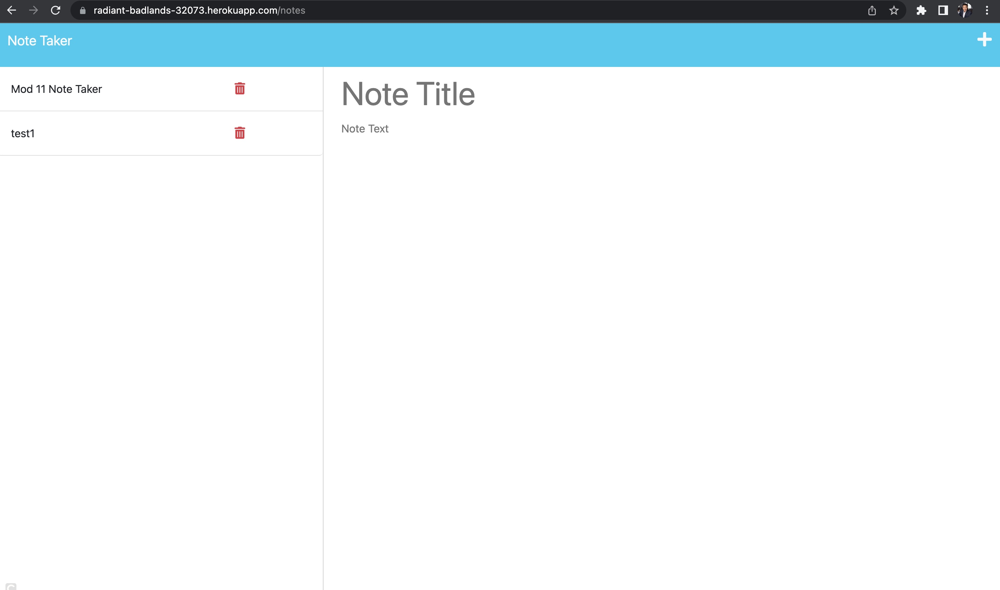
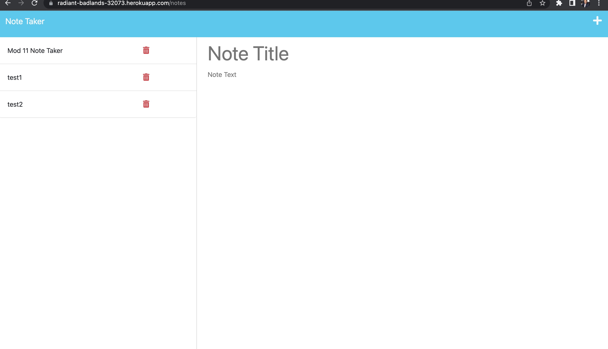

# Note Taker

This project is a Note Taker application. The application allows users to write, save, and delete notes. Front end starter code was provided for this challenge and the back end was created with Express.js.

## Installation

Clone the GitHub code to your local computer and run npm install in the command line interface.

## Usage

In the command line interface, run 'npm start', then go to http://localhost:3001 to use the Note Taker application.

## Link to github repository

[GitHub Repository](https://github.com/Qaizen/note-taker)

## Link to app

[Video Link](https://youtu.be/JiwDQ8MsAho)

## Screenshots

